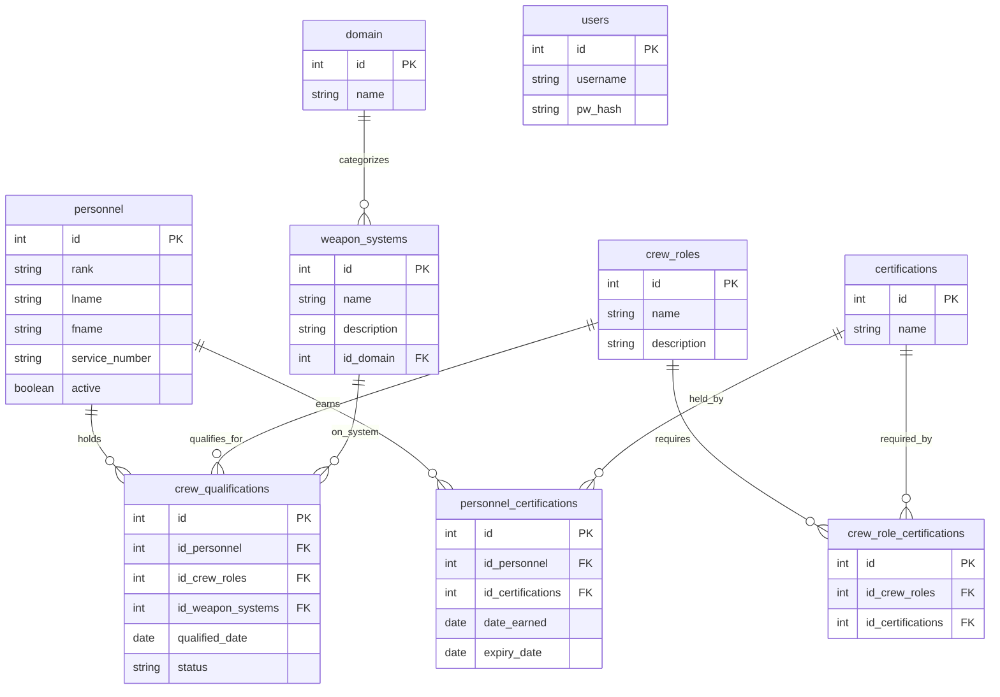

## ERD

```mermaid
erDiagram
  personnel ||--o{ crew_qualifications : holds
  crew_roles ||--o{ crew_qualifications : qualifies_for
  weapon_systems ||--o{ crew_qualifications : on_system
  domain ||--o{ weapon_systems : categorizes
  personnel ||--o{ personnel_certifications : earns
  certifications ||--o{ personnel_certifications : held_by
  crew_roles ||--o{ crew_role_certifications : requires
  certifications ||--o{ crew_role_certifications : required_by

  users {
    int id PK
    string username
    string pw_hash
  }
  personnel {
    int id PK
    string rank
    string lname
    string fname
    string service_number
    boolean active
  }
  crew_roles {
    int id PK
    string name
    string description
  }
  weapon_systems {
    int id PK
    string name
    string description
    int id_domain FK
  }
  domain {
    int id PK
    string name
  }
  crew_qualifications {
    int id PK
    int id_personnel FK
    int id_crew_roles FK
    int id_weapon_systems FK
    date qualified_date
    string status
  }
  certifications {
    int id PK
    string name
  }
  personnel_certifications {
    int id PK
    int id_personnel FK
    int id_certifications FK
    date date_earned
    date expiry_date
  }
  crew_role_certifications {
    int id PK
    int id_crew_roles FK
    int id_certifications FK
  }
```
