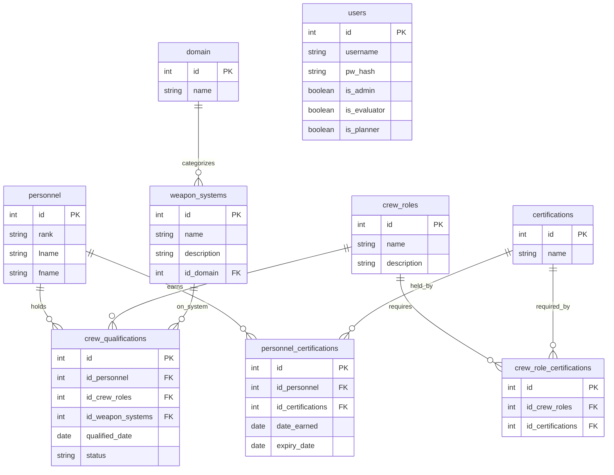

# The Squad
<table>
  <tr>
    <td><strong>Squad Lead</strong></td>
  </tr>
  <tr>
    <td>SSG James Roe</td>
  </tr>
</table>
<table>
  <tr>
    <td><strong>Front Enders</strong></td>
  </tr>
  <tr>
    <td>SSG Davy Yang</td>
    <td>Spc3 Jacob Augustine Flory</td>
  </tr>
</table>
<table>
  <tr>
    <td><strong>Back Enders</strong></td>
  </tr>
  <tr>
    <td>TSgt Chester Bullard</td>
    <td>TSgt Daren Respicio</td>
  </tr>
</table>

# Problem Statement

- Current personnel tracking is fragmented across disconnected spreadsheets and PowerPoint presentations. This leaves commanders without a centralized method to evaluate unit readiness in real time, leading to ineffective management.

- Where My Troops At?™ centralizes personnel tracking into a single platform. The application delivers real-time visibility into unit readiness, eliminates manual tracking, and empowers commanders to make fast, data-driven decisions.

## ERD

---

## Features:

  
Implemented Features

  <table>
    <!-- <tr>
      <th>Feature</th>
    </tr> -->
    <tr>
      <td><strong>Role-Based Authentication:</strong> Secure login with automatic dashboard routing based on user permissions.</td>
    </tr>
    <tr>
      <td><strong>General User Dashboard:</strong> Displays personal identity details, qualifications, active certifications, tracking for weapon systems, assigned missions, and upcoming milestones.</td>
    </tr>
    <tr>
      <td><strong>Admin Controls:</strong> Interface for evaluator management, trainee rosters, catalog searches, and tools for bullk spreadsheet/data uploads.</td>
    </tr>
    <tr>
      <td><strong>Evaluator Workspace:</strong> Personnel search and filtering options alongside a dedicated, editable trainee roster.</td>
    </tr>
    <tr>
      <td><strong>MPC Planning Dashboard:</strong> Mission summary views and active mission planners equipped with dynamic readiness trackers.</td>
    </tr>
    <tr>
      <td><strong>Mission Wizard:</strong> Multi-step creation tool covering core mission parametes, CONOP development, personnel assignment, and readiness approval workflows.</td>
    </tr>
    <tr>
      <td><strong>Global Shell:</strong> Shared navbar with consistent branding, navigation paths, and a native light/dark mode switch.</td>
    </tr>
    <tr>
      <td>Global shared styling (single source for theme colors/variables and font in index.css - removed duplicate/conflicting per-page copies)</td>
    </tr>
  </table>

---

  
In-progress

  <table>
    <tr>
      <th>Task</th>
      <th>Team member</th>
    </tr>
    <tr>
    </tr>
  </table>

---

## Application Endpoints

Base URL: `http://localhost:5173`

| Endpoint       | Description                                      |
| -------------- | ------------------------------------------------ |
| `/`            | Application Login Page                           |
| `/Admin`       | Admin Dashboard                                  |
| `/MPC`         | Mission Planning Dashboard                       |
| `/GeneralUser` | Personal Certifications/Qualifications Dashboard |
| `/Evaluator`   | Evaluator Dashboard                              |

---

## API Endpoints

  
Details

Base URL: `http://localhost:8080`

### Homepage

| Method | Endpoint | Description       |
| ------ | -------- | ----------------- |
| GET    | `/`      | API homepage text |

### Users — `/users`

| Method | Endpoint         | Description                                                                                                                                            |
| ------ | ---------------- | ------------------------------------------------------------------------------------------------------------------------------------------------------ |
| GET    | `/users`         | Fetch global users                                                                                                                      |
| GET    | `/users/:userId` | Fetch specific user using unique ID                                                                                                                                |
| POST   | `/users`         | Inject new user |
| PATCH  | `/users/:userId` | Modify specific user using a unique ID                                                                          |
| DELETE | `/users/:userId` | Remove a user using a unique ID                                                                                                                                         |

### Domains — `/domains`

| Method | Endpoint             | Description                       |
| ------ | -------------------- | --------------------------------- |
| GET    | `/domains`           | Fetch operational domains   |
| GET    | `/domains/:domainId` | Fetch specific domain using a unique ID         |
| POST   | `/domains`           | Inject a new domain |
| PATCH  | `/domains/:domainId` | Modify a specific domain using a unique ID |
| DELETE | `/domains/:domainId` | Remove a specific domain using a unique ID                   |

### Personnel — `/personnel`

| Method | Endpoint               | Description                                                                                       |
| ------ | ---------------------- | ------------------------------------------------------------------------------------------------- |
| GET    | `/personnel`           | Fetch global personnel |
| GET    | `/personnel/:personId` | Fetch a specific personnel unsing a unique ID                                                                         |
| POST   | `/personnel`           | Inject a new personnel record                                         |
| PATCH  | `/personnel/:personId` | Modify a specific personnel using a unique ID                            |
| PATCH  | `/personnel?name=`     | Modify a specfic personnel using a matching string                     |
| DELETE | `/personnel/:personId` | Remove a spcefic personnel using a unique ID                                                                           |
| DELETE | `/personnel?name=`     | Remove a specific personnel using a matching string                                                                    |

### Weapon Systems — `/weaponsystems`

| Method | Endpoint                          | Description                                                                                    |
| ------ | --------------------------------- | ---------------------------------------------------------------------------------------------- |
| GET    | `/weaponsystems`                  | Fetch global weapon systems                                                       |
| GET    | `/weaponsystems/:systemId`        | Fetch a specfici weapon system using a unique ID                                                              |
| POST   | `/weaponsystems`                  | Inject a new weapon system                        |
| PATCH  | `/weaponsystems/:systemId`        | Modify a specific weapon system using a unique ID          |
| PATCH  | `/weaponsystems?system=`          | Modify a specific weapon system using a matching string |
| DELETE | `/weaponsystems/:systemId`        | Remove a weapon system using a unique ID                                                                 |
| DELETE | `/weaponsystems?system=&acronym=` | Remove a wweapon system using a matching string                                        |

### Crew Roles — `/crewroles`

| Method | Endpoint             | Description                                                               |
| ------ | -------------------- | ------------------------------------------------------------------------- |
| GET    | `/crewroles`         | Fetch global crew roles                                        |
| GET    | `/crewroles/:roleId` | Fetch a specific crew role using a unique ID                                            |
| POST   | `/crewroles`         | Inject a new crew role                       |
| PATCH  | `/crewroles/:roleId` | Modify a crew role using a unique ID           |
| PATCH  | `/crewroles?role=`   | Modify a specific crew role using a matching string |
| DELETE | `/crewroles/:roleId` | Remove a specific crew role using a unique ID                                                |
| DELETE | `/crewroles?role=`   | Remove a specific crew role using a matching string                                              |

### Certifications — `/certs`

| Method | Endpoint         | Description                                               |
| ------ | ---------------- | --------------------------------------------------------- |
| GET    | `/certs`         | Fetch global certifications                   |
| GET    | `/certs/:certId` | Fetch a specific certification using a unique ID                         |
| POST   | `/certs`         | Inject a new certification                  |
| PATCH  | `/certs/:certId` | Modify a certification using a unique ID           |
| PATCH  | `/certs?name=`   | Modify a certification using a matching string |
| DELETE | `/certs/:certId` | Remove a certification using a unique ID                             |
| DELETE | `/certs?name=`   | Remove a certification using a matching string                           |

### Crew Qualifications — `/quals`

| Method | Endpoint                             | Description                                                                                                |
| ------ | ------------------------------------ | ---------------------------------------------------------------------------------------------------------- |
| GET    | `/quals`                             | Fetch global crew qualifications |
| GET    | `/quals/:personId`                   | Fetch specific crew qualification using unique ID                                                                           |
| POST   | `/quals`                             | Inject crew qualification record                                      |
| PATCH  | `/quals/:personId/:roleId/:systemId` | Modify crew qualification record using unique ID                                                                           |
| PATCH  | `/quals?member=&role=&system=`       | Modify crew qualification record using matching string                                                                         |
| DELETE | `/quals/:personId/:roleId/:systemId` | Remove crew qualification record using unique ID                                                                             |
| DELETE | `/quals?member=&role=&system=`       | Remove a crew qualification using a matching string                                                                           |

Note: `is_current` is computed at query time — true if `qualified_date` is less than a year old.

### Personnel Certifications — `/perscerts`

| Method | Endpoint                       | Description                                                                                 |
| ------ | ------------------------------ | ------------------------------------------------------------------------------------------- |
| GET    | `/perscerts`                   | Fetch global personnel with respective certifications |
| GET    | `/perscerts/:personId`         | Fetch certification record for specific personnel using unique ID                                                             |
| POST   | `/perscerts`                   | Inject certification record to personnel      |
| PATCH  | `/perscerts/:personId/:certId` | Modify certification record for personnel using unique ID                       |
| DELETE | `/perscerts/:personId/:certId` | Remove certification record from personnel using unique ID                                                 |
| DELETE | `/perscerts?member=&cert=`     | Remove certification record from personnel using matching string                                              |

`is_current` is computed at query time — true if `expiry_date` hasn't passed yet.

### Crew Role Certifications — `/crewcerts`

| Method | Endpoint                     | Description                                                                            |
| ------ | ---------------------------- | -------------------------------------------------------------------------------------- |
| GET    | `/crewcerts`                 | Fetch global crew role certifications |
| GET    | `/crewcerts/:roleId`         | Fetch a specific crew role certification using a unique ID                                            |
| POST   | `/crewcerts`                 | Inject a new crew role certification          |
| DELETE | `/crewcerts?role=&cert=`     | Remove a specific crew role certification using a matching string                             |
| DELETE | `/crewcerts/:roleId/:certId` | Remove a specific crew role certification using a unique ID                               |

---

## 
 Resources 

### [Calendar.js]('https://calendarjs.com/docs')

