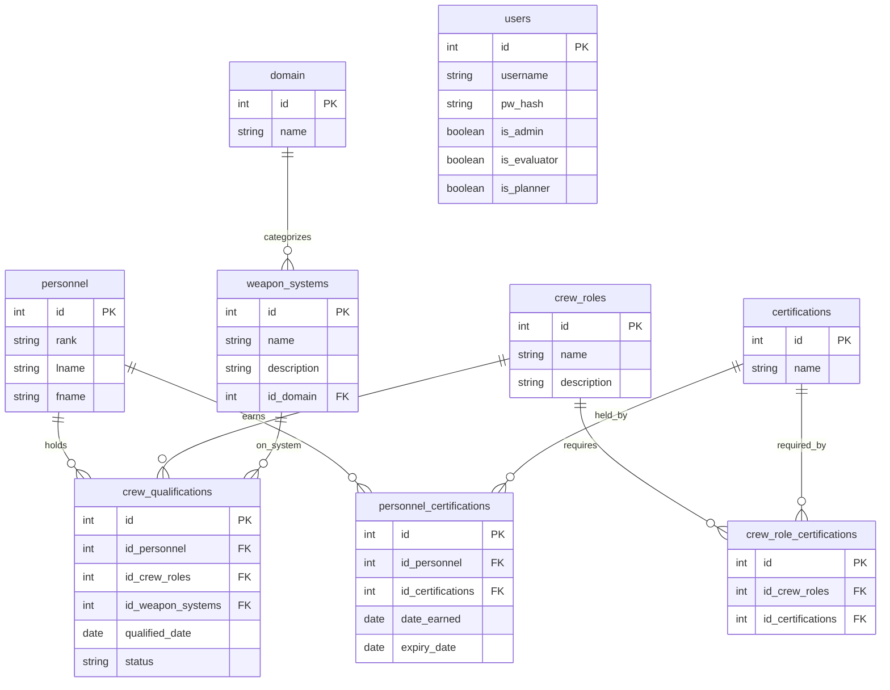

# Problem Statement

- Current personnel tracking is fragmented across disconnected spreadsheets and PowerPoint presentations. This leaves commanders without a centralized method to evaluate unit readiness in real time, leading to ineffective management of unit personnel.

- Where My Troops At?™ aims to centralize personnel tracking by providing commanders with a single platform to manage and monitor unit personnel information in real time. This will improve visibility into unit readiness, reduce reliance on disconnected spreadsheets and presentations, and enable more effective personnel management and informed decision-making.

## ERD

---

## API Endpoints

Base URL: `http://localhost:8080`

### Homepage

| Method | Endpoint | Description       |
| ------ | -------- | ----------------- |
| GET    | `/`      | API homepage text |

### Users — `/users`

| Method | Endpoint         | Description                                                                                                                                                       |
| ------ | ---------------- | ----------------------------------------------------------------------------------------------------------------------------------------------------------------- |
| GET    | `/users`         | List users. Optional `?username=`                                                                                                                                 |
| GET    | `/users/:userId` | Get a single user by id                                                                                                                                           |
| POST   | `/users`         | Create a user. Body: `{ username, pw_hash, is_admin?, is_evaluator?, is_planner? }` (`pw_hash` is the plaintext password; it's hashed server-side before storing) |
| PATCH  | `/users/:userId` | Update a user. Body: any of `{ pw_hash, is_admin, is_evaluator, is_planner }`                                                                                     |
| DELETE | `/users/:userId` | Delete a user                                                                                                                                                     |

### Domains — `/domains`

| Method | Endpoint             | Description                       |
| ------ | -------------------- | --------------------------------- |
| GET    | `/domains`           | List domains. Optional `?name=`   |
| GET    | `/domains/:domainId` | Get a single domain by id         |
| POST   | `/domains`           | Create a domain. Body: `{ name }` |
| PATCH  | `/domains/:domainId` | Rename a domain. Body: `{ name }` |
| DELETE | `/domains/:domainId` | Delete a domain                   |

### Personnel — `/personnel`

| Method | Endpoint               | Description                                                                                       |
| ------ | ---------------------- | ------------------------------------------------------------------------------------------------- |
| GET    | `/personnel`           | List personnel. Optional `?name=` (full-name ilike filter), `?firstName=`, `?lastName=`, `?rank=` |
| GET    | `/personnel/:personId` | Get a single person by id                                                                         |
| POST   | `/personnel`           | Create a person. Body: `{ rank, first_name, last_name }`                                          |
| PATCH  | `/personnel/:personId` | Update a person, by id. Body: any of `{ rank, last_name, first_name }`                            |
| PATCH  | `/personnel?name=`     | Update a person, by full name. Body: any of `{ rank, last_name, first_name }`                     |
| DELETE | `/personnel/:personId` | Delete a person, by id                                                                            |
| DELETE | `/personnel?name=`     | Delete a person, by full name                                                                     |

### Weapon Systems — `/weaponsystems`

| Method | Endpoint                          | Description                                                                                    |
| ------ | --------------------------------- | ---------------------------------------------------------------------------------------------- |
| GET    | `/weaponsystems`                  | List weapon systems. Optional `?system=`                                                       |
| GET    | `/weaponsystems/:systemId`        | Get a single weapon system by id                                                               |
| POST   | `/weaponsystems`                  | Create a weapon system. Body: `{ name, acronym?, description, domain }`                        |
| PATCH  | `/weaponsystems/:systemId`        | Update a weapon system, by id. Body: any of `{ name, acronym, description, domain }`           |
| PATCH  | `/weaponsystems?system=`          | Update a weapon system, by current name. Body: any of `{ name, acronym, description, domain }` |
| DELETE | `/weaponsystems/:systemId`        | Delete a weapon system, by id                                                                  |
| DELETE | `/weaponsystems?system=&acronym=` | Delete weapon system(s) matching `system` or `acronym`                                         |

### Crew Roles — `/crewroles`

| Method | Endpoint             | Description                                                               |
| ------ | -------------------- | ------------------------------------------------------------------------- |
| GET    | `/crewroles`         | List crew roles. Optional `?role=`                                        |
| GET    | `/crewroles/:roleId` | Get a single crew role by id                                              |
| POST   | `/crewroles`         | Create a crew role. Body: `{ role, description? }`                        |
| PATCH  | `/crewroles/:roleId` | Update a crew role, by id. Body: any of `{ name, description }`           |
| PATCH  | `/crewroles?role=`   | Update a crew role, by current name. Body: any of `{ name, description }` |
| DELETE | `/crewroles/:roleId` | Delete a crew role, by id                                                 |
| DELETE | `/crewroles?role=`   | Delete a crew role, by name                                               |

### Certifications — `/certs`

| Method | Endpoint         | Description                                               |
| ------ | ---------------- | --------------------------------------------------------- |
| GET    | `/certs`         | List certifications. Optional `?name=`                    |
| GET    | `/certs/:certId` | Get a single certification by id                          |
| POST   | `/certs`         | Create a certification. Body: `{ name }`                  |
| PATCH  | `/certs/:certId` | Rename a certification, by id. Body: `{ name }`           |
| PATCH  | `/certs?name=`   | Rename a certification, by current name. Body: `{ name }` |
| DELETE | `/certs/:certId` | Delete a certification, by id                             |
| DELETE | `/certs?name=`   | Delete a certification, by name                           |

### Crew Qualifications — `/quals`

| Method | Endpoint                             | Description                                                                                                |
| ------ | ------------------------------------ | ---------------------------------------------------------------------------------------------------------- |
| GET    | `/quals`                             | List personnel with their qualifications (role, system, qualified_date, `is_current`). Optional `?member=` |
| GET    | `/quals/:personId`                   | Get one person's qualifications                                                                            |
| POST   | `/quals`                             | Add a qualification. Body: `{ member, role, system, qualified_date }`                                      |
| PATCH  | `/quals/:personId/:roleId/:systemId` | Update `qualified_date`, by ids                                                                            |
| PATCH  | `/quals?member=&role=&system=`       | Update `qualified_date`, by names                                                                          |
| DELETE | `/quals/:personId/:roleId/:systemId` | Remove a qualification, by ids                                                                             |
| DELETE | `/quals?member=&role=&system=`       | Remove a qualification, by names                                                                           |

`is_current` is computed at query time — true if `qualified_date` is less than a year old.

### Personnel Certifications — `/perscerts`

| Method | Endpoint                       | Description                                                                                 |
| ------ | ------------------------------ | ------------------------------------------------------------------------------------------- |
| GET    | `/perscerts`                   | List personnel with their certifications (certId, dates, `is_current`). Optional `?member=` |
| GET    | `/perscerts/:personId`         | Get one person's certifications                                                             |
| POST   | `/perscerts`                   | Assign a certification to a person. Body: `{ member, cert, date_earned, expiry_date }`      |
| PATCH  | `/perscerts/:personId/:certId` | Update `date_earned` and/or `expiry_date` for an existing assignment                        |
| DELETE | `/perscerts/:personId/:certId` | Remove a certification from a person, by id                                                 |
| DELETE | `/perscerts?member=&cert=`     | Remove a certification from a person, by name                                               |

`is_current` is computed at query time — true if `expiry_date` hasn't passed yet.

### Crew Role Certifications — `/crewcerts`

| Method | Endpoint                     | Description                                                                            |
| ------ | ---------------------------- | -------------------------------------------------------------------------------------- |
| GET    | `/crewcerts`                 | List crew roles with their required certifications (roleId, certId). Optional `?role=` |
| GET    | `/crewcerts/:roleId`         | Get one crew role's required certifications                                            |
| POST   | `/crewcerts`                 | Require a certification for a crew role. Body: `{ crewRole, certification }`           |
| DELETE | `/crewcerts?role=&cert=`     | Remove a required certification from a crew role, by name                              |
| DELETE | `/crewcerts/:roleId/:certId` | Remove a required certification from a crew role, by id                                |

---

## 
 Resources 

### [Calendar.js]('https://calendarjs.com/docs')

