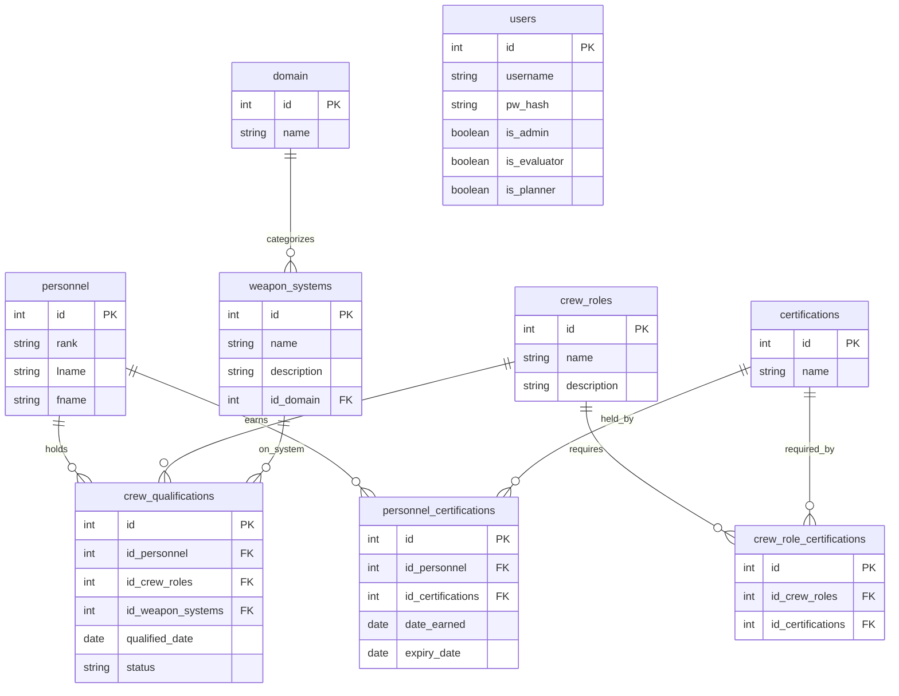

# Problem Statement

- Current personnel tracking is fragmented across disconnected spreadsheets and PowerPoint presentations. This leaves commanders without a centralized method to evaluate unit readiness in real time, leading to ineffective management of unit personnel.

- Where My Troops At?™ aims to centralize personnel tracking by providing commanders with a single platform to manage and monitor unit personnel information in real time. This will improve visibility into unit readiness, reduce reliance on disconnected spreadsheets and presentations, and enable more effective personnel management and informed decision-making.

## ERD

---

## API Endpoints

Base URL: `http://localhost:8080`

### Homepage

| Method | Endpoint | Description |
| --- | --- | --- |
| GET | `/` | API homepage text |

### Users — `/users`

| Method | Endpoint | Description |
| --- | --- | --- |
| GET | `/users` | List users. Optional `?username=` (ilike filter) |
| GET | `/users/:userId` | Get a single user by id |
| POST | `/users` | Create a user. Body: `{ username, pw_hash, is_admin?, is_evaluator?, is_planner? }` (`pw_hash` is the plaintext password; it's hashed server-side before storing) |
| PATCH | `/users/:userId` | Update a user. Body: any of `{ pw_hash, is_admin, is_evaluator, is_planner }` |
| DELETE | `/users/:userId` | Delete a user |

### Domains — `/domains`

| Method | Endpoint | Description |
| --- | --- | --- |
| GET | `/domains` | List domains. Optional `?name=` (ilike filter) |
| GET | `/domains/:domainId` | Get a single domain by id |
| POST | `/domains` | Create a domain. Body: `{ name }` |
| PATCH | `/domains/:domainId` | Rename a domain. Body: `{ name }` |
| DELETE | `/domains/:domainId` | Delete a domain (cascades to its weapon systems) |

### Personnel — `/personnel`

| Method | Endpoint | Description |
| --- | --- | --- |
| GET | `/personnel` | List all personnel |

### Weapon Systems — `/weaponsystems`

| Method | Endpoint | Description |
| --- | --- | --- |
| GET | `/weaponsystems` | List all weapon systems |

### Crew Roles — `/crewroles`

| Method | Endpoint | Description |
| --- | --- | --- |
| GET | `/crewroles` | List all crew roles |

### Certifications — `/certs`

| Method | Endpoint | Description |
| --- | --- | --- |
| GET | `/certs` | List all certifications |

### Crew Qualifications — `/quals`

| Method | Endpoint | Description |
| --- | --- | --- |
| GET | `/quals` | List all crew qualifications |

### Personnel Certifications — `/perscerts`

| Method | Endpoint | Description |
| --- | --- | --- |
| GET | `/perscerts` | List personnel with their certifications. Optional `?member=` (ilike filter on full name) |
| GET | `/perscerts/:personId` | Get one person's certifications |
| POST | `/perscerts` | Assign a certification to a person. Body: `{ member, cert, date_earned, expiry_date }` |
| PATCH | `/perscerts/:personId/:certId` | Update `date_earned` and/or `expiry_date` for an existing assignment |
| DELETE | `/perscerts/:personId/:certId` | Remove a certification from a person, by id |
| DELETE | `/perscerts?member=&cert=` | Remove a certification from a person, by name |

### Crew Role Certifications — `/crewcerts`

| Method | Endpoint | Description |
| --- | --- | --- |
| GET | `/crewcerts` | List crew roles with their required certifications. Optional `?role=` (ilike filter) |
| GET | `/crewcerts/:roleId` | Get one crew role's required certifications |
| POST | `/crewcerts` | Require a certification for a crew role. Body: `{ crewRole, certification }` |
| DELETE | `/crewcerts?role=&cert=` | Remove a required certification from a crew role, by name |
| DELETE | `/crewcerts/:roleId/:certId` | Remove a required certification from a crew role, by id |

---

## 
 Resources 

### [Calendar.js]('https://calendarjs.com/docs')

