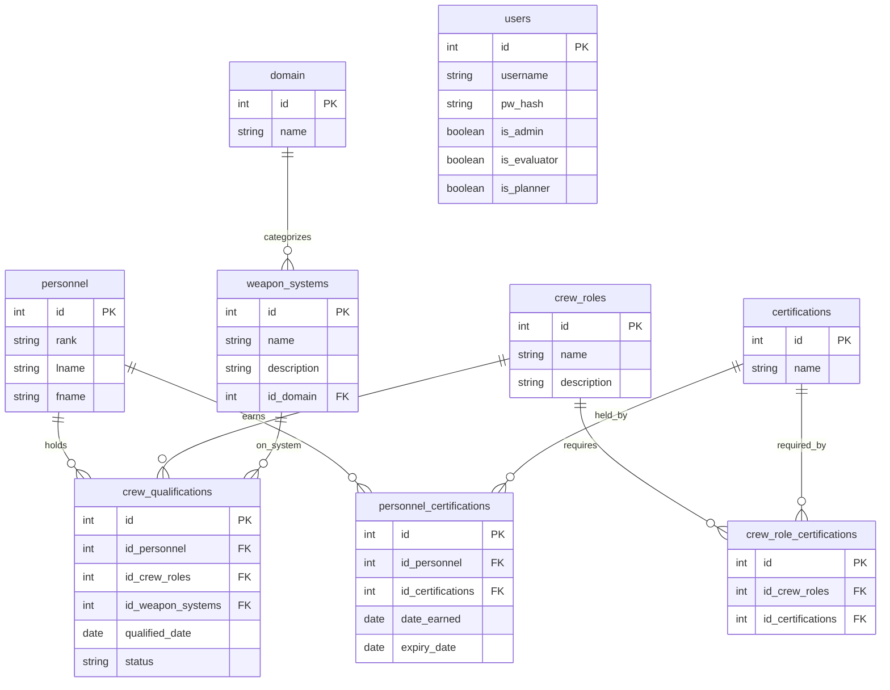

# Problem Statement

- Current personnel tracking is fragmented across disconnected spreadsheets and PowerPoint presentations. This leaves commanders without a centralized method to evaluate unit readiness in real time, leading to ineffective management of unit personnel.

- Where My Troops At?™ aims to centralize personnel tracking by providing commanders with a single platform to manage and monitor unit personnel information in real time. This will improve visibility into unit readiness, reduce reliance on disconnected spreadsheets and presentations, and enable more effective personnel management and informed decision-making.

## ERD

---

## 
 Resources 

### [Calendar.js]('https://calendarjs.com/docs')

